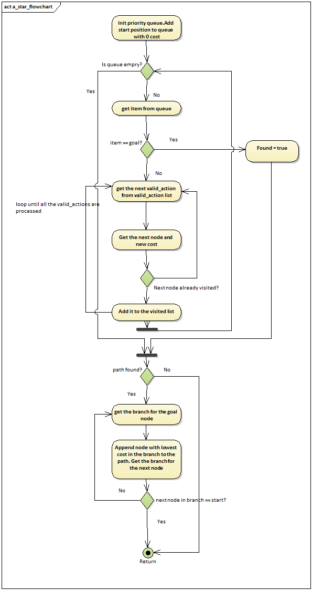

## Project: 3D Motion Planning

---

# Required Steps for a Passing Submission:
1. Load the 2.5D map in the colliders.csv file describing the environment.
2. Discretize the environment into a grid or graph representation.
3. Define the start and goal locations.
4. Perform a search using A* or other search algorithm.
5. Use a collinearity test or ray tracing method (like Bresenham) to remove unnecessary waypoints.
6. Return waypoints in local ECEF coordinates (format for `self.all_waypoints` is [N, E, altitude, heading], where the drone’s start location corresponds to [0, 0, 0, 0].
7. Write it up.
8. Congratulations!  Your Done!

## [Rubric](https://review.udacity.com/#!/rubrics/1534/view) Points
### Here I will consider the rubric points individually and describe how I addressed each point in my implementation.  

---
### Writeup / README

#### 1. Provide a Writeup / README that includes all the rubric points and how you addressed each one.  You can submit your writeup as markdown or pdf.  

You're reading it! Below I describe how I addressed each rubric point and where in my code each point is handled.

### Explain the Starter Code

#### 1. Explain the functionality of what's provided in `motion_planning.py` and `planning_utils.py`
These scripts contain a basic planning implementation that includes a MotionPlanning class and some planning utilities. I will explaining these in detail below.

##### Motion Planning class
This class inherits from the drone class and contains the functions necessary for executing a plan.
The various states of a drone are : MANUAL, ARMING, TAKEOFF, WAYPOINT, DISARMING, PLANNING, and LANDING. The execution of a plan is basically a set of state transitions by the drone. The drone transitions from one state to another in a sequential manner. The state transistions are triggered based on certain conditions. These triggers and transitions are handled in various callbacks defined in the MotionPlanning class. The sequence of transitions is 
MANUAL->ARMING->PLANNING->TAKEOFF->WAYPOINT->...->WAYPOINT->LANDING->DISARMING->MANUAL

The triggers for ARMING, TAKEOFF, PLANNING and MANUAL state transitions are handled in state_callback function. The triggers for WAYPOINT and LANDING transitions are handled in local_position_callback function. When the drone is taking off, it checks for the drone altitude and triggers WAYPOINT transition if the altitude is around 0.95 of the target altitude. When the drone is in waypoint transition, it triggers further waypoint transitions if the drone has a reached a particular waypoint. It triggers LANDING transition if the drone is at the last waypoint in the list of waypoints. 

The DISARMING trigger is handled in velocity_callback function. It calls the disarming transition after landing if the difference between drone altitude and global_home is less than 0.1

The main function establishes a connection with the simulator drone and then calls arming transition. This is followed by planning transition, where the path is planned for the drone.

The planning of the path for the drone is handled in the plan_path function. This function first sets the target altitude and safety distance for the drone. It then loads the map details from colliders.csv and calls the create grid function from `planning_utils.py` (explained below) to get the grid representation of the map. This grid representation is passed to the search algorithm(A* ) along with the start and goal positions. The search algorithm return a set of points in (northing, easting) format. This is used to define waypoints for the drone. The waypoints is then sent to the drone using send_waypoint function. The drone then transitions to takeoff and follows the plan to reach all the waypoints sent to the drone.

Once the drone reaches the last waypoint in the list, the drone transitions to landing and then disarmming. After disarming the drone the program terminates the mavlink connection to the simulator.

##### Planning Utitlities
The  `planning_utils.py` file contains the following functions that help in planning a path:
1. create grid: This function is used to create a grid representation of the map. It first creates an empty grid of the size of the map. It then calculates the co ordinates of the obstacles and sets all the corresponding grid cell values to 1. It returns the 2D grid.
2. Action class: This class inherits from Enum class. it defines all the actions that the drone can take, namely, NORTH, SOUTH, EAST and WEST. It also defines two properties, delta that has the delta change required in the position to take a particular action and the cost which is the cost associated with taking a particular action. All the actions have equal cost.
3. Valid actions function: This function returns a list of all the valid actions a drone can take from a particular cell in the grid. It removes a particular action from the valid action list if taking that action can lead to the drone hitting an obstacle.
4. a_star: This is the searching algorithm. It uses Priority queues to sort based on the cost of the path. The algorithm is implemented as follows:

5. heuristic: This function returns the normal distance between to points.

### Implementing Your Path Planning Algorithm

#### 1. Set your global home position
I used readline function to read the first line and then split the string using the string.split() function with ',' as the delimiter to get the latitude and longitude string. I then used the float typecasting to convert the latitude and longitude strings to float after splitting using ' ' as the delimiter.

I passed the latitude and longitude values obtained in the above step to the set_home_position function to set the global home position.

The idea to use readline function and float typecasting was obtained from the slack forum.

#### 2. Set your current local position

I retrived the currecnt global position using the class variables self.\_latitude, self.\_longitude and self.\_altitude. I then passed this to the global_to_local function to obtain the local position.

#### 3. Set grid start position from local position

I set the start position to current_local_position with an offset so it starts from the middle/global_home. The reason I added an offset was because when I got the current local position from global_to_local function, this returned [0,0,0] as  my drone was at the home position. And when I used this directly, the drone tried to go to 0,0 on the grid first and then execute the plan. This means maybe we have to plan to reach grid 0,0 position or set 0,0 as our home position.

#### 4. Set grid goal position from geodetic coords
I declared an array of the desired lat, lon and altitude and passed this to the global_to_local postion to get the northing and easting values for my goal.

#### 5. Modify A* to include diagonal motion (or replace A* altogether)

I added the diagonal motion in Actions class, with the delta as (1,1) and cost as sqrt(2).
I also modified the valid actions function to remove diagonal action from valid action list if the cell to the diagonal of the current cell is part of an obstacle.

I decided to go with graph implementation instead of grid implementation. For this, I added a create_grid_and_edges and graph_a_star function.
The create_grid_and_edges function first creates a grid representation of the map provided and adds the centre of the obstacles to a points list. A Voronoi graph is then created using the points obtained above. I then check if each edge in the graph is colliding with an obstacle and add the vertices of the edges that don't collide with obstacles to a list and return this list.

The graph_a_star function is similar to the normal a_star function described above. Instead of iterating over valid actions, we need to iterate over all the adjacent nodes in the graph.

#### 6. Cull waypoints 
I added the function prune_path, collinearity_check and point function for accomplishing this.

To prune the path, I am using a simple collinearity test. I get the determinant of the array formed by concatenating all the points. If the determinant value is less than epsilon, I conclude that the points are collinear. This decision comes from the fact that if the points are collinear, the area formed by the points must be near 0. I set the epsilon for 1e-6 for grid implementation. I found that changing that to 1e-2 will give better results for graph representation.

### Execute the flight
#### 1. Does it work?
It works! The latitude, longitude range for the map provided is really less. It varies in the third or fourth decimal place! I initially had trouble getting it to work with any lat lon value. I then realised that the lat lon I was trying was outside map limits! I used local to global to check the range for the values north_max , north_min, east_max and east_min that's obtained in create_grid function and started giving values within this range.

